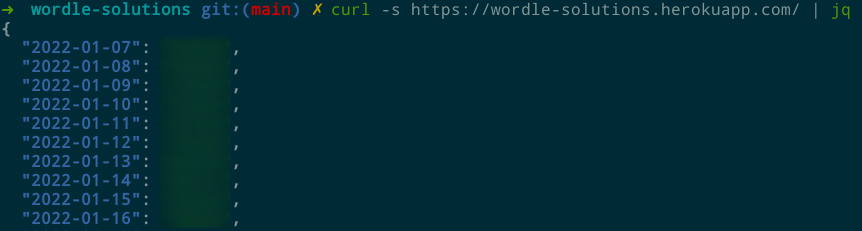

# Wordle (ES) solutions

API that provides Wordle (ES) solutions in JSON format.

From 2022-01-07 to 2023-09-15.

Game URL: [https://wordle.danielfrg.com/](https://wordle.danielfrg.com/)

## Usage

```bash
curl https://wordle-solutions.herokuapp.com/<date-iso-format>
```

Examples:
```bash
curl https://wordle-solutions.herokuapp.com/ # Returns all solutions
```

```bash
curl https://wordle-solutions.herokuapp.com/2022-02-06 # Returns solution of the day
```

Recommendation: use jq to parse.



## Why?
Weekend project. Unlike [original Wordle version](https://www.powerlanguage.co.uk/wordle/), solutions are (client-side) encrypted. Seemed funny to script.

## Future work (not me)
Maybe a front-end?

## Disclaimer
Crappy code.
